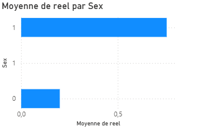
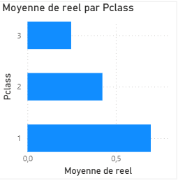

# Data Analytics & MLOps Project

## Description
End-to-end data analytics pipeline built with Python and SQL, containerized with Docker, with an interactive Power BI dashboard.

## Technologies
- Python (pandas, scikit-learn, matplotlib)
- SQL (SQLite)
- Docker
- Power BI

## Results
- 891 passengers analyzed
- 80% model accuracy
- 3 interactive dashboard visualizations

## How to run
```bash
docker build -t mon-pipeline .
docker run mon-pipeline
```

## Project Structure
```
├── pipeline.py       # Main pipeline
├── requirements.txt  # Dependencies
├── Dockerfile        # Docker configuration
└── resultats.csv     # Model results
```

## Dashboard Power BI




